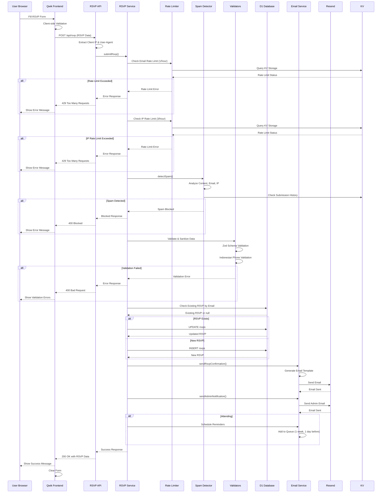
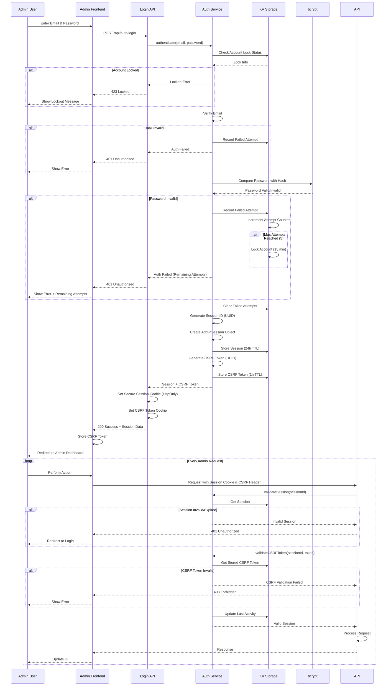
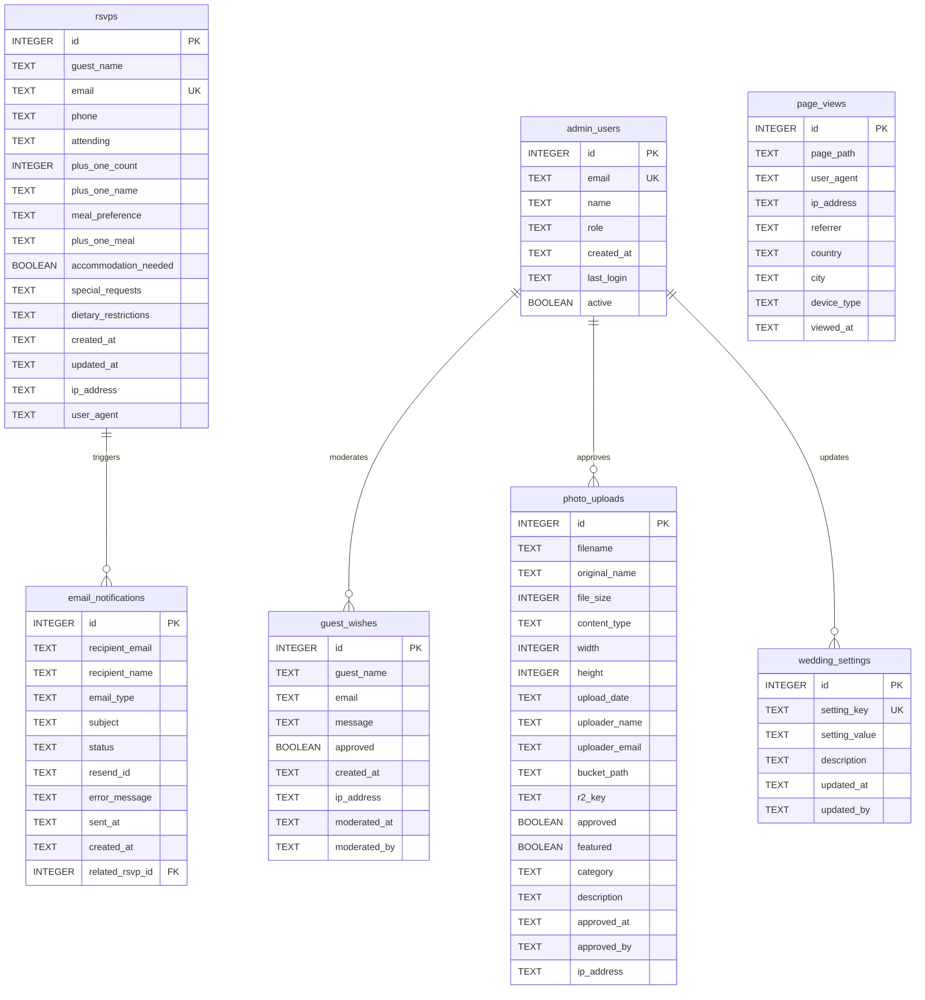

# Alfina & Mugni Wedding Website - Architecture Diagrams

> **Generated**: October 14, 2025  
> **Project**: Wedding Invitation & Management System  
> **Stack**: Qwik, TypeScript, Cloudflare Pages/Workers, D1, R2, KV

---

## Table of Contents

1. [Overall System Architecture](#1-overall-system-architecture)
2. [RSVP Submission Flow](#2-rsvp-submission-flow)
3. [Admin Authentication Flow](#3-admin-authentication-flow)
4. [Database Schema](#4-database-schema)
5. [Deployment & Infrastructure](#5-deployment--infrastructure)
6. [Component Hierarchy](#6-component-hierarchy)
7. [Email Workflow & Queue System](#7-email-workflow--queue-system)

---

## 1. Overall System Architecture

This diagram shows the complete system architecture from the client layer through to external services.

### Key Components:

#### **Client Layer**
- **Web Browser**: Standard web browser access
- **PWA (Progressive Web App)**: Installable web app with offline capabilities
- **Service Worker**: Handles caching, offline support, and background sync

#### **Qwik Frontend**
- **Pages**: Home, Admin Dashboard, Auth, Gallery
- **Components**: 12 main sections (Hero, Countdown, Story, Details, Gift, RSVP, Wishes, Gallery, QR Code, Contact, Footer)
- **UI Components**: 50+ Shadcn/UI components for consistent design
- **Hooks**: useGallery, useMobile, useToast for state management

#### **API Layer (Cloudflare Pages Functions)**
- **Public APIs**: RSVP, Wishes, Gallery, Upload, Analytics
- **Auth APIs**: Login, Logout with session management
- **Admin APIs**: CRUD operations for RSVPs, Wishes, Gallery, Settings

#### **Service Layer**
- **RSVP Service**: Validation, rate limiting, spam detection
- **Wishes Service**: Moderation workflow, spam detection
- **Gallery Service**: File upload, image processing, approval workflow
- **Email Service**: Resend integration, queue management, template rendering
- **Auth Service**: bcrypt password hashing, session management, CSRF protection

#### **Library Layer**
- **Database Library**: Type-safe D1 queries with error handling
- **Validators**: Zod schemas, input sanitization, Indonesian phone validation
- **Rate Limiter**: IP and email-based limiting using KV storage
- **Spam Detector**: Content analysis, frequency checking, pattern matching
- **Security**: XSS prevention, CSRF tokens, input sanitization
- **Analytics**: Page views, event tracking, user metrics

#### **Cloudflare Services**
- **D1 Database**: SQLite database with 7 tables
  - rsvps, guest_wishes, photo_uploads, admin_users
  - email_notifications, wedding_settings, page_views
- **R2 Storage**: Object storage for photos and assets
- **KV Storage**: Key-value storage for sessions, cache, rate limiting

#### **External Services**
- **Resend**: Email service (3000/month free tier)
- **Unsplash**: Stock photos for gallery

```mermaid
graph TB
    subgraph "Client Layer"
        Browser[Web Browser]
        PWA[Progressive Web App]
        ServiceWorker[Service Worker]
    end

    subgraph "Qwik Frontend"
        Router[Qwik City Router]
        
        subgraph "Pages"
            HomePage[Home Page]
            AdminPages[Admin Pages]
            AuthPages[Auth Pages]
            GalleryPage[Gallery Page]
        end
        
        subgraph "Components"
            Navigation[Navigation]
            HeroSection[Hero Section]
            CountdownSection[Countdown Section]
            StorySection[Story Section]
            DetailsSection[Details Section]
            GiftSection[Gift Section]
            RsvpSection[RSVP Section]
            WishesSection[Wishes Section]
            GallerySection[Gallery Section]
            QRCodeSection[QR Code Section]
            ContactSection[Contact Section]
            FooterSection[Footer Section]
        end
        
        subgraph "UI Components"
            ShadcnUI[Shadcn/UI Components]
        end
        
        subgraph "Hooks"
            useGallery[useGallery]
            useMobile[useMobile]
            useToast[useToast]
        end
    end

    subgraph "API Layer"
        subgraph "Public APIs"
            RSVPAPI[RSVP API]
            WishesAPI[Wishes API]
            GalleryAPI[Gallery API]
            UploadAPI[Upload API]
            AnalyticsAPI[Analytics API]
        end
        
        subgraph "Auth APIs"
            LoginAPI[Login API]
            LogoutAPI[Logout API]
        end
        
        subgraph "Admin APIs"
            AdminRSVPAPI[Admin RSVP API]
            AdminWishesAPI[Admin Wishes API]
            AdminGalleryAPI[Admin Gallery API]
            AdminSettingsAPI[Admin Settings API]
        end
    end

    subgraph "Service Layer"
        RSVPService[RSVP Service]
        WishesService[Wishes Service]
        GalleryService[Gallery Service]
        EmailService[Email Service]
        AuthService[Auth Service]
    end

    subgraph "Library Layer"
        DatabaseLib[Database Library]
        ValidatorsLib[Validators]
        RateLimiterLib[Rate Limiter]
        SpamDetectorLib[Spam Detector]
        SecurityLib[Security]
        AnalyticsLib[Analytics]
    end

    subgraph "Cloudflare Services"
        D1[(D1 Database)]
        R2[(R2 Storage)]
        KV[(KV Storage)]
        
        subgraph "Database Tables"
            RSVPs[(rsvps)]
            GuestWishes[(guest_wishes)]
            PhotoUploads[(photo_uploads)]
            AdminUsers[(admin_users)]
            EmailNotifications[(email_notifications)]
            WeddingSettings[(wedding_settings)]
            PageViews[(page_views)]
        end
    end

    subgraph "External Services"
        Resend[Resend Email Service]
        Unsplash[Unsplash Stock Photos]
    end

    Browser -->|HTTPS| Router
    PWA -->|Offline Support| ServiceWorker
    ServiceWorker -->|Cache| Browser

    Router --> HomePage
    Router --> AdminPages
    Router --> AuthPages
    Router --> GalleryPage

    HomePage --> Navigation
    HomePage --> HeroSection
    HomePage --> CountdownSection
    HomePage --> StorySection
    HomePage --> DetailsSection
    HomePage --> GiftSection
    HomePage --> RsvpSection
    HomePage --> WishesSection
    HomePage --> GallerySection
    HomePage --> QRCodeSection
    HomePage --> ContactSection
    HomePage --> FooterSection

    RsvpSection --> ShadcnUI
    WishesSection --> ShadcnUI
    GallerySection --> ShadcnUI
    AdminPages --> ShadcnUI

    GallerySection --> useGallery
    Navigation --> useMobile
    WishesSection --> useToast

    RsvpSection --> RSVPAPI
    WishesSection --> WishesAPI
    GallerySection --> GalleryAPI
    GallerySection --> UploadAPI
    HomePage --> AnalyticsAPI

    AuthPages --> LoginAPI
    AdminPages --> LogoutAPI

    AdminPages --> AdminRSVPAPI
    AdminPages --> AdminWishesAPI
    AdminPages --> AdminGalleryAPI
    AdminPages --> AdminSettingsAPI

    RSVPAPI --> RSVPService
    WishesAPI --> WishesService
    GalleryAPI --> GalleryService
    UploadAPI --> GalleryService
    LoginAPI --> AuthService
    LogoutAPI --> AuthService

    AdminRSVPAPI --> RSVPService
    AdminWishesAPI --> WishesService
    AdminGalleryAPI --> GalleryService
    AdminSettingsAPI --> DatabaseLib

    RSVPService --> DatabaseLib
    RSVPService --> ValidatorsLib
    RSVPService --> RateLimiterLib
    RSVPService --> SpamDetectorLib
    RSVPService --> EmailService

    WishesService --> DatabaseLib
    WishesService --> ValidatorsLib
    WishesService --> RateLimiterLib
    WishesService --> SpamDetectorLib
    WishesService --> EmailService

    GalleryService --> DatabaseLib
    GalleryService --> ValidatorsLib
    GalleryService --> SecurityLib

    AuthService --> SecurityLib
    AuthService --> KV

    EmailService --> Resend

    DatabaseLib --> D1
    RateLimiterLib --> KV
    SpamDetectorLib --> KV
    AnalyticsLib --> D1

    D1 --> RSVPs
    D1 --> GuestWishes
    D1 --> PhotoUploads
    D1 --> AdminUsers
    D1 --> EmailNotifications
    D1 --> WeddingSettings
    D1 --> PageViews

    GalleryService --> R2

    GallerySection --> Unsplash

    style Browser fill:#e1f5ff
    style PWA fill:#e1f5ff
    style Router fill:#fff3e0
    style HomePage fill:#f3e5f5
    style AdminPages fill:#f3e5f5
    style RSVPAPI fill:#e8f5e9
    style WishesAPI fill:#e8f5e9
    style LoginAPI fill:#ffe0b2
    style RSVPService fill:#fff9c4
    style WishesService fill:#fff9c4
    style EmailService fill:#fff9c4
    style D1 fill:#ffebee
    style R2 fill:#ffebee
    style KV fill:#ffebee
    style Resend fill:#fce4ec
```

---

## 2. RSVP Submission Flow

This sequence diagram shows the complete flow when a guest submits an RSVP, including all validation, rate limiting, spam detection, and email notification steps.

### Flow Steps:

1. **Client-side Validation**: Form validation in the browser
2. **Rate Limiting**: 
   - Email-based: 1 RSVP per hour per email
   - IP-based: 3 RSVPs per hour per IP address
3. **Spam Detection**: Content analysis, email validation, IP reputation check
4. **Data Validation**: 
   - Zod schema validation
   - Indonesian phone number validation
   - Business logic validation (plus ones, meal preferences)
5. **Database Operation**:
   - Check for existing RSVP by email
   - Update if exists, insert if new
6. **Email Notifications**:
   - Guest confirmation email (immediate)
   - Admin notification email (immediate)
   - Reminder emails (scheduled for 1 week and 1 day before event)
7. **Response**: Success message with RSVP data

### Error Handling:
- Rate limit exceeded → 429 response
- Spam detected → 400 blocked response
- Validation failed → 400 with error details
- Database error → 500 with retry logic

---

## 3. Admin Authentication Flow

This diagram shows the complete authentication flow for admin users, including security features like account lockout, session management, and CSRF protection.

### Security Features:

1. **Account Lockout**:
   - Max 5 failed attempts
   - 15-minute lockout period
   - Automatic unlock after timeout

2. **Password Security**:
   - bcrypt hashing with 12 salt rounds
   - Constant-time comparison
   - No password hints or recovery (admin only)

3. **Session Management**:
   - 24-hour session duration
   - Secure, HttpOnly cookies
   - Automatic session refresh on activity
   - Session stored in KV with TTL

4. **CSRF Protection**:
   - UUID-based CSRF tokens
   - 1-hour token validity
   - Token validation on every protected request
   - Separate cookie (not HttpOnly for client access)

5. **Request Validation**:
   - Session validation on every admin request
   - CSRF token validation
   - Last activity tracking
   - Automatic session cleanup

---

## 4. Database Schema

Entity-Relationship diagram showing all database tables, their fields, and relationships.

### Tables Overview:

#### **rsvps**
- Stores guest RSVP responses
- Unique constraint on email (one RSVP per email)
- Tracks attendance type: both, akad, reception, unable
- Plus-one information and meal preferences
- IP address and user agent for security tracking

#### **guest_wishes**
- Stores guest messages/wishes
- Approval workflow (approved boolean)
- Moderation tracking (who and when)
- IP address for spam detection

#### **photo_uploads**
- Metadata for photos uploaded by guests
- R2 bucket path and key for storage reference
- Approval workflow with approver tracking
- Categories: ceremony, reception, guests, professional
- Featured flag for highlight photos

#### **admin_users**
- Admin user accounts
- Role-based access: admin, moderator
- Activity tracking (last login, active status)

#### **email_notifications**
- Email delivery log
- Status tracking: pending, sent, failed
- Links to related RSVP
- Resend message ID for tracking

#### **wedding_settings**
- Key-value configuration store
- Default settings for RSVP deadline, max plus-ones, etc.
- Updater tracking

#### **page_views**
- Analytics data
- Page path, user agent, IP address
- Geographic data (country, city)
- Device type classification

### Relationships:
- RSVPs → Email Notifications (one-to-many)
- Admin Users → Guest Wishes (moderation)
- Admin Users → Photo Uploads (approval)
- Admin Users → Wedding Settings (updates)

---

## 5. Deployment & Infrastructure

This diagram shows the complete deployment pipeline from development to production, including CI/CD, edge distribution, and monitoring.

### Environments:

#### **Development**
- Vite dev server for fast HMR
- Wrangler dev mode for local Cloudflare simulation
- Miniflare for local D1, R2, and KV
- Data persisted in `.wrangler/state/v3/`

#### **CI/CD Pipeline**
- GitHub Actions triggered on push/PR
- Parallel jobs: Lint, Type Check, Tests, Build
- ESLint and Prettier for code quality
- Vitest for unit and integration tests
- TypeScript compilation check

#### **Preview Environment**
- Separate Cloudflare Pages preview deployment
- Preview D1 database (wedding-database-preview)
- Preview R2 bucket (wedding-photos-bucket-preview)
- Preview KV namespaces
- Unique URL per PR for testing

#### **Production Environment**
- Cloudflare Pages deployment
- Global edge network (275+ locations)
- Production D1 database with 7 tables
- Production R2 bucket for photos
- Production KV for sessions and rate limiting

### Cloudflare Services:

#### **Edge Network**
- Distributed across 275+ cities worldwide
- Automatic geographic routing
- Edge caching for static assets
- Dynamic content at the edge

#### **Security**
- DDoS protection (unlimited, unmetered)
- Web Application Firewall (WAF)
- SSL/TLS certificates (automatic)
- Rate limiting at the edge

#### **Monitoring**
- Real-time logs via Cloudflare Dashboard
- Performance metrics and analytics
- Wrangler CLI for remote management
- Database migrations via Wrangler

### External Services:
- **Resend**: Email service (3000/month free tier)
- **Unsplash**: Stock photos for gallery placeholders

```mermaid
graph TB
    subgraph "Development Environment"
        DevMachine[Developer Machine]
        ViteDevServer[Vite Dev Server]
        LocalD1[Local D1 - Miniflare]
        LocalR2[Local R2 - Miniflare]
        LocalKV[Local KV - Miniflare]
        WranglerDev[Wrangler Dev Mode]
        
        DevMachine --> ViteDevServer
        DevMachine --> WranglerDev
        WranglerDev --> LocalD1
        WranglerDev --> LocalR2
        WranglerDev --> LocalKV
    end

    subgraph "CI/CD Pipeline"
        GitHub[GitHub Repository]
        GitHubActions[GitHub Actions]
        BuildProcess[Build Process]
        TestRunner[Vitest Runner]
        LintCheck[ESLint & Prettier]
        TypeCheck[TypeScript Check]
        
        GitHub -->|Push/PR| GitHubActions
        GitHubActions --> LintCheck
        GitHubActions --> TypeCheck
        GitHubActions --> TestRunner
        GitHubActions --> BuildProcess
    end

    subgraph "Cloudflare Pages Production"
        CFPages[Cloudflare Pages]
        CFWorkers[Pages Functions]
        
        subgraph "Edge Network"
            Edge1[Edge Location 1]
            Edge2[Edge Location 2]
            Edge3[Edge Location N]
        end
        
        CFPages --> Edge1
        CFPages --> Edge2
        CFPages --> Edge3
    end

    subgraph "Cloudflare Data Services"
        ProdD1[(D1 Production<br/>wedding-database)]
        ProdR2[(R2 Production<br/>wedding-photos-bucket)]
        ProdKV[(KV Production<br/>SESSIONS & ADMIN_KV)]
        
        subgraph "D1 Tables"
            T1[rsvps]
            T2[guest_wishes]
            T3[photo_uploads]
            T4[admin_users]
            T5[email_notifications]
            T6[wedding_settings]
            T7[page_views]
        end
        
        ProdD1 --> T1
        ProdD1 --> T2
        ProdD1 --> T3
        ProdD1 --> T4
        ProdD1 --> T5
        ProdD1 --> T6
        ProdD1 --> T7
    end

    subgraph "Preview Environment"
        PreviewPages[Cloudflare Pages Preview]
        PreviewD1[(D1 Preview<br/>wedding-database-preview)]
        PreviewR2[(R2 Preview<br/>wedding-photos-bucket-preview)]
        PreviewKV[(KV Preview<br/>preview namespaces)]
    end

    subgraph "External Services"
        ResendAPI[Resend Email API<br/>Free Tier: 3000/month]
        UnsplashAPI[Unsplash API<br/>Stock Photos]
        CFAnalytics[Cloudflare Analytics]
    end

    subgraph "Monitoring & Security"
        CFDashboard[Cloudflare Dashboard]
        WranglerCLI[Wrangler CLI]
        Logs[Real-time Logs]
        Metrics[Performance Metrics]
        WAF[Web Application Firewall]
        DDoSProtection[DDoS Protection]
        SSLCerts[SSL/TLS Certificates]
    end

    BuildProcess -->|Deploy Production| CFPages
    BuildProcess -->|Deploy Preview| PreviewPages
    
    CFWorkers --> ProdD1
    CFWorkers --> ProdR2
    CFWorkers --> ProdKV
    CFWorkers --> ResendAPI
    
    PreviewPages --> PreviewD1
    PreviewPages --> PreviewR2
    PreviewPages --> PreviewKV
    
    Edge1 --> CFWorkers
    Edge2 --> CFWorkers
    Edge3 --> CFWorkers
    
    CFPages --> CFAnalytics
    CFPages --> WAF
    CFPages --> DDoSProtection
    CFPages --> SSLCerts
    
    CFDashboard --> ProdD1
    CFDashboard --> ProdR2
    CFDashboard --> ProdKV
    CFDashboard --> Logs
    CFDashboard --> Metrics
    
    WranglerCLI --> ProdD1
    WranglerCLI --> ProdR2
    WranglerCLI --> ProdKV
    
    CFWorkers --> UnsplashAPI

    style DevMachine fill:#e3f2fd
    style ViteDevServer fill:#e3f2fd
    style GitHub fill:#f3e5f5
    style GitHubActions fill:#f3e5f5
    style CFPages fill:#e8f5e9
    style CFWorkers fill:#e8f5e9
    style Edge1 fill:#fff3e0
    style Edge2 fill:#fff3e0
    style Edge3 fill:#fff3e0
    style ProdD1 fill:#ffebee
    style ProdR2 fill:#ffebee
    style ProdKV fill:#ffebee
    style ResendAPI fill:#fce4ec
    style CFDashboard fill:#f1f8e9
    style WAF fill:#fff9c4
    style DDoSProtection fill:#fff9c4
    style SSLCerts fill:#fff9c4
```

---

## 6. Component Hierarchy

This diagram shows the complete component tree from root to leaf components, including routing, layouts, and state management.

### Component Structure:

#### **Root Level**
- **root.tsx**: QwikCityProvider wrapper
- **RouterHead**: Meta tags, SEO, favicons
- **Service Worker**: PWA functionality registration

#### **Layouts**
- **layout.tsx**: Main layout for public pages
- **admin/layout.tsx**: Protected layout for admin pages with authentication guard

#### **Public Pages**
- **index.tsx**: Main landing page with all sections
- **gallery/index.tsx**: Dedicated gallery view
- **auth/signin/index.tsx**: Admin login page

#### **Admin Pages**
- **admin/dashboard/index.tsx**: Overview and statistics
- **admin/rsvps/index.tsx**: RSVP list and management
- **admin/wishes/index.tsx**: Wish moderation
- **admin/gallery/index.tsx**: Photo approval
- **admin/settings/index.tsx**: System configuration

#### **Feature Components** (12 sections)
1. **Navigation**: Mobile-responsive menu with scroll spy
2. **HeroSection**: Animated welcome with couple names
3. **CountdownSection**: Real-time countdown to wedding day
4. **StorySection**: Love story timeline
5. **DetailsSection**: Event details (akad & reception)
6. **GiftSection**: Gift registry and bank information
7. **RsvpSection**: RSVP form with validation
8. **WishesSection**: Guest wishes display and submission
9. **GallerySection**: Photo gallery with lightbox
10. **QRCodeSection**: QR code for easy sharing
11. **ContactSection**: Contact information and social media
12. **FooterSection**: Credits and copyright

#### **Shared UI Components** (50+ from Shadcn/UI)
- Form elements: Button, Input, Select, Checkbox, Radio, Textarea
- Data display: Card, Table, Badge, Avatar, Tabs
- Feedback: Alert, Dialog, Toast, Progress
- Overlays: Dialog, Drawer, Popover, Tooltip
- Navigation: Tabs, Breadcrumb, Pagination

#### **Specialized Components**
- **PhotoUpload**: Enhanced file upload with drag & drop
- **PhotoEditor**: Image cropping and resizing
- **PhotoSlideshow**: Auto-playing carousel
- **PhotoCollage**: Masonry layout for gallery
- **PublicGallery**: Filterable photo grid
- **MobilePhotoUpload**: Camera integration for mobile
- **AdaptiveImage**: Responsive image with srcset
- **InstallPrompt**: PWA installation banner
- **OfflineIndicator**: Network status indicator
- **SocialShare**: Social media sharing buttons
- **SEOHead**: Dynamic meta tags for SEO
- **ThemeProvider**: Dark/light mode support

#### **Custom Hooks**
- **useGallery**: Gallery state management and WebSocket updates
- **useMobile**: Responsive breakpoint detection
- **useToast**: Toast notification system

```mermaid
graph TD
    subgraph "Root Application"
        Root[root.tsx<br/>QwikCityProvider]
        RouterHead[RouterHead<br/>Meta Tags & SEO]
        ServiceWorkerReg[Service Worker Registration]
    end

    subgraph "Layout Hierarchy"
        MainLayout[layout.tsx<br/>Root Layout]
        AdminLayout[admin/layout.tsx<br/>Protected Layout]
    end

    subgraph "Public Pages"
        IndexPage[index.tsx<br/>Home Page]
        GalleryPageRoute[gallery/index.tsx<br/>Gallery Page]
        AuthSignin[auth/signin/index.tsx<br/>Admin Login]
    end

    subgraph "Admin Pages"
        AdminDashboard[admin/dashboard/index.tsx<br/>Dashboard]
        AdminRSVPs[admin/rsvps/index.tsx<br/>RSVP Management]
        AdminWishes[admin/wishes/index.tsx<br/>Wish Moderation]
        AdminGallery[admin/gallery/index.tsx<br/>Photo Management]
        AdminSettings[admin/settings/index.tsx<br/>Settings]
    end

    subgraph "Feature Components"
        Navigation[Navigation<br/>Mobile Responsive]
        HeroSection[Hero Section<br/>Animated Entry]
        CountdownSection[Countdown Section<br/>Real-time Timer]
        StorySection[Story Section<br/>Timeline]
        DetailsSection[Details Section<br/>Event Info]
        GiftSection[Gift Section<br/>Bank Info]
        RsvpSection[RSVP Section<br/>Form + Validation]
        WishesSection[Wishes Section<br/>Display + Submit]
        GallerySection[Gallery Section<br/>Photo Grid]
        QRCodeSection[QR Code Section<br/>QR Generator]
        ContactSection[Contact Section<br/>Social Links]
        FooterSection[Footer Section<br/>Credits]
    end

    subgraph "Shared UI Components"
        Button[Button]
        Card[Card]
        Dialog[Dialog]
        Form[Form]
        Input[Input]
        Select[Select]
        Table[Table]
        Toast[Toast]
        Tabs[Tabs]
        Badge[Badge]
        Avatar[Avatar]
        Calendar[Calendar]
        Progress[Progress]
        Alert[Alert]
    end

    subgraph "Specialized Components"
        PhotoUpload[Enhanced Photo Upload<br/>Drag & Drop]
        PhotoEditor[Photo Editor<br/>Crop & Resize]
        PhotoSlideshow[Photo Slideshow<br/>Auto-play]
        PhotoCollage[Photo Collage<br/>Masonry Layout]
        PublicGallery[Public Gallery<br/>Filter & Search]
        MobilePhotoUpload[Mobile Photo Upload<br/>Camera Integration]
        AdaptiveImage[Adaptive Image<br/>Responsive Sizes]
        InstallPrompt[Install Prompt<br/>PWA Banner]
        OfflineIndicator[Offline Indicator<br/>Connection Status]
        SocialShare[Social Share<br/>Share Buttons]
        SEOHead[SEO Head<br/>Metadata]
        ThemeProvider[Theme Provider<br/>Dark/Light Mode]
    end

    subgraph "Custom Hooks"
        useGalleryHook[useGallery<br/>Gallery State Management]
        useMobileHook[useMobile<br/>Responsive Detection]
        useToastHook[useToast<br/>Notification System]
    end

    Root --> RouterHead
    Root --> ServiceWorkerReg
    Root --> MainLayout

    MainLayout --> IndexPage
    MainLayout --> GalleryPageRoute
    MainLayout --> AuthSignin
    MainLayout --> AdminLayout

    AdminLayout --> AdminDashboard
    AdminLayout --> AdminRSVPs
    AdminLayout --> AdminWishes
    AdminLayout --> AdminGallery
    AdminLayout --> AdminSettings

    IndexPage --> Navigation
    IndexPage --> HeroSection
    IndexPage --> CountdownSection
    IndexPage --> StorySection
    IndexPage --> DetailsSection
    IndexPage --> GiftSection
    IndexPage --> RsvpSection
    IndexPage --> WishesSection
    IndexPage --> GallerySection
    IndexPage --> QRCodeSection
    IndexPage --> ContactSection
    IndexPage --> FooterSection

    RsvpSection --> Form
    RsvpSection --> Input
    RsvpSection --> Select
    RsvpSection --> Button
    RsvpSection --> Card
    RsvpSection --> Alert

    WishesSection --> Card
    WishesSection --> Input
    WishesSection --> Button
    WishesSection --> Badge
    WishesSection --> useToastHook

    GallerySection --> PhotoUpload
    GallerySection --> PublicGallery
    GallerySection --> PhotoSlideshow
    GallerySection --> Dialog
    GallerySection --> useGalleryHook

    AdminRSVPs --> Table
    AdminRSVPs --> Dialog
    AdminRSVPs --> Button
    AdminRSVPs --> Badge
    AdminRSVPs --> Tabs

    AdminWishes --> Table
    AdminWishes --> Dialog
    AdminWishes --> Button
    AdminWishes --> Badge

    AdminGallery --> PhotoEditor
    AdminGallery --> Table
    AdminGallery --> Dialog
    AdminGallery --> Button

    AdminSettings --> Form
    AdminSettings --> Input
    AdminSettings --> Select
    AdminSettings --> Button
    AdminSettings --> Card

    Navigation --> useMobileHook

    PhotoUpload --> MobilePhotoUpload
    PhotoUpload --> Progress
    PhotoUpload --> Alert

    GallerySection --> AdaptiveImage
    GallerySection --> PhotoCollage

    IndexPage --> InstallPrompt
    IndexPage --> OfflineIndicator
    IndexPage --> SocialShare
    IndexPage --> SEOHead
    IndexPage --> ThemeProvider

    style Root fill:#e3f2fd
    style MainLayout fill:#f3e5f5
    style AdminLayout fill:#fff3e0
    style IndexPage fill:#e8f5e9
    style AdminDashboard fill:#ffebee
    style RsvpSection fill:#fce4ec
    style GallerySection fill:#f1f8e9
    style PhotoUpload fill:#fff9c4
    style useGalleryHook fill:#e0f2f1
```

---

## 7. Email Workflow & Queue System

This diagram shows the complete email system including triggers, queue management, template generation, delivery tracking, and Resend API integration.

### Email System Features:

#### **Email Triggers**
1. **RSVP Submission**: Immediate confirmation to guest + admin notification
2. **Wish Submission**: Admin notification if moderation required
3. **Photo Upload**: Admin notification for approval
4. **Scheduled Events**: Reminders (1 week, 1 day before wedding)
5. **Admin Summaries**: Daily and weekly statistics

#### **Queue Management**
- **Priority System**: Immediate vs scheduled
- **Batch Processing**: Max 10 emails per batch
- **Retry Logic**: 3 attempts with exponential backoff
- **Queue Storage**: In-memory array (could be moved to KV for persistence)

#### **Rate Limiting**
- **Free Tier Check**: 3000 emails/month limit
- **Monthly Counter**: Tracks email usage
- **Over-limit Handling**: Queue emails for later processing

#### **Template System**
1. **RSVP Confirmation**: Personalized with event details, bilingual (ID/EN)
2. **Admin Notification**: Detailed RSVP info with quick action links
3. **Reminders**: 1 week and 1 day before wedding
4. **Wish Moderation**: Admin alert with wish content
5. **Admin Summary**: Daily/weekly statistics dashboard

#### **Delivery Tracking**
- **Status Map**: Tracks delivery status by message ID
- **Webhook Integration**: Receives delivery events from Resend
- **Status Updates**: sent → delivered/bounced/complained
- **Database Logging**: Stores all notifications in email_notifications table

#### **Email Types**

##### Guest Emails (Immediate):
- RSVP Confirmation
- Thank You (post-event)

##### Guest Emails (Scheduled):
- 1 Week Reminder
- 1 Day Reminder

##### Admin Emails (Immediate):
- New RSVP Notification
- Wish Moderation Request
- Photo Approval Request

##### Admin Emails (Scheduled):
- Daily Summary (9 AM)
- Weekly Summary (Monday 9 AM)

#### **Resend Integration**
- **API**: RESTful email sending API
- **Webhooks**: Delivery status updates
- **Events**: sent, delivered, opened, clicked, bounced, complained
- **Tagging**: Wedding-specific tags for analytics
- **Free Tier**: 3000 emails/month

```mermaid
graph TB
    subgraph "Email Triggers"
        RsvpSubmit[RSVP Submission]
        WishSubmit[Wish Submission Requires Moderation]
        PhotoUpload[Photo Upload Needs Review]
        ScheduledEvent[Scheduled Event Reminder]
        AdminSummary[Daily/Weekly Admin Summary]
    end

    subgraph "Email Service"
        EmailService[WeddingEmailService]
        
        subgraph "Email Queue"
            QueueManager[Queue Manager]
            EmailQueue[(Email Queue Array)]
            QueueProcessor[Queue Processor]
        end
        
        subgraph "Template Generator"
            RsvpConfirmTemplate[RSVP Confirmation Template]
            AdminNotifTemplate[Admin Notification Template]
            ReminderTemplate[Reminder Template - 1 week & 1 day]
            WishModTemplate[Wish Moderation Template]
            SummaryTemplate[Admin Summary Template]
        end
        
        subgraph "Rate Limiting"
            FreeTierCheck[Free Tier Check<br/>3000/month limit]
            MonthlyCounter[Monthly Email Counter]
        end
        
        subgraph "Delivery Tracking"
            DeliveryMap[Delivery Status Map]
            MessageIDTracker[Message ID Tracker]
            StatusUpdater[Status Updater]
        end
    end

    subgraph "Resend API Integration"
        ResendAPI[Resend Email API]
        ResendWebhook[Resend Webhooks]
        
        subgraph "Email Events"
            Sent[Email Sent]
            Delivered[Email Delivered]
            Bounced[Email Bounced]
            Complained[Spam Complaint]
            Opened[Email Opened]
            Clicked[Link Clicked]
        end
    end

    subgraph "Email Types & Recipients"
        GuestEmails[Guest Recipients]
        AdminEmails[Admin Recipients]
        
        subgraph "Guest Email Types"
            Confirmation[RSVP Confirmation<br/>Immediate]
            Reminder1Week[1 Week Reminder<br/>Scheduled]
            Reminder1Day[1 Day Reminder<br/>Scheduled]
            ThankYou[Thank You Email<br/>Post-Event]
        end
        
        subgraph "Admin Email Types"
            NewRsvpNotif[New RSVP Notification<br/>Immediate]
            WishReview[Wish Moderation Request<br/>Immediate]
            PhotoReview[Photo Approval Request<br/>Immediate]
            DailySummary[Daily Summary<br/>Scheduled 9 AM]
            WeeklySummary[Weekly Summary<br/>Scheduled Monday 9 AM]
        end
    end

    subgraph "Database Integration"
        EmailNotifTable[(email_notifications table)]
        RSVPTable[(rsvps table)]
    end

    RsvpSubmit -->|Trigger| EmailService
    WishSubmit -->|Trigger| EmailService
    PhotoUpload -->|Trigger| EmailService
    ScheduledEvent -->|Trigger| EmailService
    AdminSummary -->|Trigger| EmailService

    EmailService --> FreeTierCheck
    FreeTierCheck -->|Within Limit| QueueManager
    FreeTierCheck -->|Over Limit| EmailQueue

    QueueManager -->|Immediate| RsvpConfirmTemplate
    QueueManager -->|Immediate| AdminNotifTemplate
    QueueManager -->|Immediate| WishModTemplate
    QueueManager -->|Scheduled| ReminderTemplate
    QueueManager -->|Scheduled| SummaryTemplate

    RsvpConfirmTemplate --> ResendAPI
    AdminNotifTemplate --> ResendAPI
    WishModTemplate --> ResendAPI
    ReminderTemplate --> EmailQueue
    SummaryTemplate --> EmailQueue

    EmailQueue --> QueueProcessor
    QueueProcessor -->|Process Batch| ResendAPI
    QueueProcessor -->|Retry Failed| EmailQueue

    ResendAPI --> Sent
    Sent --> DeliveryMap
    Sent --> MonthlyCounter
    Sent --> MessageIDTracker

    ResendWebhook --> Delivered
    ResendWebhook --> Bounced
    ResendWebhook --> Complained
    ResendWebhook --> Opened
    ResendWebhook --> Clicked

    Delivered --> StatusUpdater
    Bounced --> StatusUpdater
    Complained --> StatusUpdater
    
    StatusUpdater --> DeliveryMap
    StatusUpdater --> EmailNotifTable

    RsvpConfirmTemplate --> GuestEmails
    ReminderTemplate --> GuestEmails
    
    AdminNotifTemplate --> AdminEmails
    WishModTemplate --> AdminEmails
    SummaryTemplate --> AdminEmails

    GuestEmails --> Confirmation
    GuestEmails --> Reminder1Week
    GuestEmails --> Reminder1Day
    GuestEmails --> ThankYou

    AdminEmails --> NewRsvpNotif
    AdminEmails --> WishReview
    AdminEmails --> PhotoReview
    AdminEmails --> DailySummary
    AdminEmails --> WeeklySummary

    EmailNotifTable -->|Log| RsvpSubmit
    RSVPTable -->|Related| EmailNotifTable

    style EmailService fill:#e3f2fd
    style QueueManager fill:#f3e5f5
    style FreeTierCheck fill:#fff3e0
    style ResendAPI fill:#e8f5e9
    style DeliveryMap fill:#ffebee
    style RsvpConfirmTemplate fill:#fce4ec
    style AdminNotifTemplate fill:#f1f8e9
    style ReminderTemplate fill:#fff9c4
    style Sent fill:#c8e6c9
    style Delivered fill:#a5d6a7
    style Bounced fill:#ef9a9a
    style EmailQueue fill:#ffe082
```

---

## Technology Stack Summary

### Frontend
- **Framework**: Qwik 1.14.1 (Resumable, Zero Hydration)
- **Routing**: Qwik City (File-based)
- **Styling**: Tailwind CSS 3.4.14
- **UI Components**: Shadcn/UI (50+ components)
- **Icons**: @qwikest/icons
- **Forms**: @modular-forms/qwik
- **Animation**: Motion (12.23.11)
- **PWA**: @qwikdev/pwa

### Backend
- **Runtime**: Cloudflare Workers (V8 isolates)
- **Functions**: Cloudflare Pages Functions
- **Database**: Cloudflare D1 (SQLite)
- **Object Storage**: Cloudflare R2
- **Key-Value Store**: Cloudflare KV
- **Email**: Resend API

### Development Tools
- **Language**: TypeScript 5.4.5
- **Build Tool**: Vite 5.3.5
- **Package Manager**: pnpm 9.15.4
- **Testing**: Vitest 3.2.4
- **Linting**: ESLint 9.25.1
- **Formatting**: Prettier 3.3.3
- **Local Dev**: Wrangler 4.38.0

### Security & Validation
- **Schema Validation**: Zod 4.1.5
- **Password Hashing**: bcryptjs 3.0.2
- **Input Sanitization**: Custom security lib
- **CSRF Protection**: UUID-based tokens
- **Rate Limiting**: KV-based

### Utilities
- **Date/Time**: date-fns 4.1.0
- **Class Names**: clsx 2.1.1, tailwind-merge 3.3.1
- **Notifications**: sonner 2.0.7
- **Image Optimization**: sharp 0.34.4

---

## Key Features

### Guest Features
- ✅ Responsive wedding invitation
- ✅ RSVP with meal preferences
- ✅ Guest wishes with moderation
- ✅ Photo gallery upload
- ✅ Event countdown
- ✅ QR code sharing
- ✅ Offline support (PWA)
- ✅ Social media integration

### Admin Features
- ✅ Secure authentication
- ✅ RSVP management dashboard
- ✅ Wish moderation
- ✅ Photo approval workflow
- ✅ Email notification system
- ✅ Analytics dashboard
- ✅ Configuration settings
- ✅ CSV export

### Technical Features
- ✅ Edge-first architecture
- ✅ Zero cold starts
- ✅ Global CDN distribution
- ✅ Automatic scaling
- ✅ Rate limiting
- ✅ Spam detection
- ✅ Email queue management
- ✅ Real-time validation
- ✅ SEO optimized
- ✅ Type-safe throughout

---

## Performance Characteristics

### Load Times
- **First Contentful Paint**: < 1.5s
- **Time to Interactive**: < 3s
- **Total Blocking Time**: < 300ms

### Edge Performance
- **Cold Start**: 0ms (Workers on V8 isolates)
- **Warm Response**: < 50ms globally
- **Database Query**: < 10ms (D1 read)
- **R2 Object Access**: < 100ms

### Scalability
- **Concurrent Requests**: Unlimited (auto-scaling)
- **Database**: 5 GB storage (D1 free tier)
- **R2 Storage**: 10 GB storage (free tier)
- **KV Operations**: 100k reads/day (free tier)
- **Email**: 3000/month (Resend free tier)

---

## Security Measures

1. **Authentication**
   - bcrypt password hashing (12 salt rounds)
   - Secure, HttpOnly session cookies
   - CSRF token protection
   - Account lockout after failed attempts

2. **Input Validation**
   - Zod schema validation
   - Input sanitization
   - SQL injection prevention (prepared statements)
   - XSS prevention

3. **Rate Limiting**
   - IP-based rate limiting
   - Email-based rate limiting
   - Edge rate limiting
   - API throttling

4. **Spam Detection**
   - Content analysis
   - Frequency checking
   - Email validation
   - Pattern matching

5. **Infrastructure Security**
   - DDoS protection (Cloudflare)
   - WAF rules
   - SSL/TLS encryption
   - Edge security policies

---

## Deployment Checklist

### Pre-deployment
- [ ] Environment variables configured
- [ ] Database migrations run
- [ ] Admin credentials set
- [ ] Email service configured
- [ ] R2 buckets created
- [ ] KV namespaces created

### Production
- [ ] DNS configured
- [ ] SSL certificate active
- [ ] Cloudflare proxy enabled
- [ ] Analytics configured
- [ ] Error tracking setup
- [ ] Monitoring enabled

### Post-deployment
- [ ] Smoke tests passed
- [ ] Admin login verified
- [ ] Email delivery tested
- [ ] RSVP flow tested
- [ ] Photo upload tested
- [ ] Backup strategy configured

---

## Maintenance Tasks

### Daily
- Check RSVP submissions
- Moderate guest wishes
- Approve photos
- Monitor email delivery

### Weekly
- Review analytics
- Check database size
- Monitor error rates
- Update content

### Monthly
- Database backup
- Security audit
- Performance review
- Dependency updates

---

## Future Enhancements

1. **Real-time Updates**
   - WebSocket integration for live updates
   - Real-time guest count
   - Live photo stream

2. **Advanced Features**
   - Multi-language support
   - Video messages
   - Gift registry integration
   - Seating chart management

3. **Analytics**
   - Advanced visitor tracking
   - Heatmaps
   - Conversion funnels
   - A/B testing

4. **Integration**
   - Calendar integration (Google, iCal)
   - Maps integration
   - Payment processing
   - Social media auto-posting

---

## Contact & Support

For technical questions or issues, please refer to:
- Documentation: `/docs/`
- API Documentation: `/docs/api/`
- Troubleshooting: `/docs/troubleshooting/`

---

**Last Updated**: October 14, 2025  
**Version**: 1.0.0  
**Status**: Production Ready

